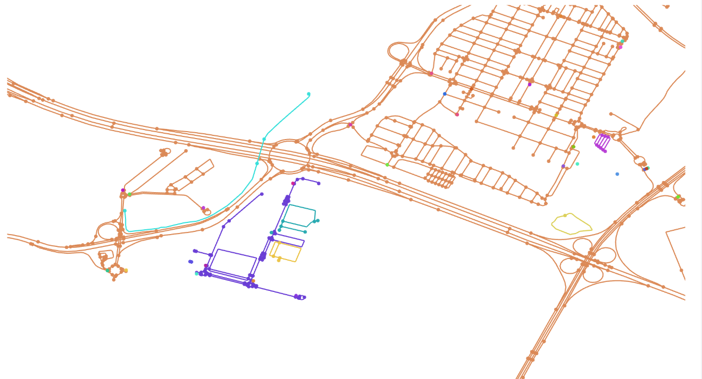

# Mapeo del entorno

El entorno urbano del modelo se construye a partir de datos reales procedentes de OpenStreetMap (OSM), una base de datos geoespacial colaborativa y de acceso abierto que contiene información detallada sobre carreteras, edificios e infraestructuras.

Estos datos permiten no solo representar la geometría de la ciudad, sino también georreferenciar la función de los edificios mediante sus etiquetas (por ejemplo, educativo, comercial, sanitario, etc.), lo que resulta clave para asignar destinos coherentes a los agentes dentro del modelo.

A partir de esta información, se han generado los grafos de movilidad peatonal y vehicular que permiten simular los desplazamientos. Para su correcto funcionamiento dentro de la plataforma GAMA, dichos grafos deben ser completamente conectados, garantizando la existencia de un camino entre cualquier par de nodos y permitiendo así el cálculo adecuado de rutas.

El proceso de mapeo para generar estos grafos se ha llevado a cabo siguiendo el manual *Automating Urban Cartography: A Reproducible Method for Agent-Based Simulation with QGIS and GAMA*, basado en una metodología reproducible y escalable que reduce la intervención manual y facilita su aplicación a distintos contextos urbanos.

Siguiendo este enfoque, se ha construido la red urbana y se han incorporado puntos de interés relevantes que posteriormente son utilizados por los agentes para definir sus destinos y desplazamientos.

## Scripts de validación
Para validar técnicamente estas redes se han desarrollado dos scripts de inspección que reconstruyen externamente los grafos a partir de los shapefiles y permiten comprobar su conectividad antes de la ejecución completa del modelo:

1. `road_graph_inspector.py`: reconstruye el grafo viario a partir de `ROADS` y `CROSSROADS`, respetando el sentido de circulación de las vías y permitiendo detectar componentes desconectadas, nodos aislados, carreteras excluidas o errores de conexión. Además, ofrece una interfaz visual para inspeccionar la red, seleccionar nodos origen-destino y contrastar los resultados con la ejecución real en GAMA.

2. `pedestrian_graph_inspector.py`: reconstruye el grafo peatonal a partir de `STREETS` y `CROSSROADS`, verificando la continuidad de los itinerarios a pie e identificando fragmentos desconectados o tramos mal enlazados. Del mismo modo, permite inspeccionar visualmente la red y comparar el cálculo de trayectos con el comportamiento observado en GAMA.

*Interfaz del inspector del grafo viario, utilizada para validar la conectividad de la red reconstruida y comprobar rutas entre pares de nodos.*

## Referencias

El manual utilizado está disponible en:

https://zenodo.org/records/15356514
