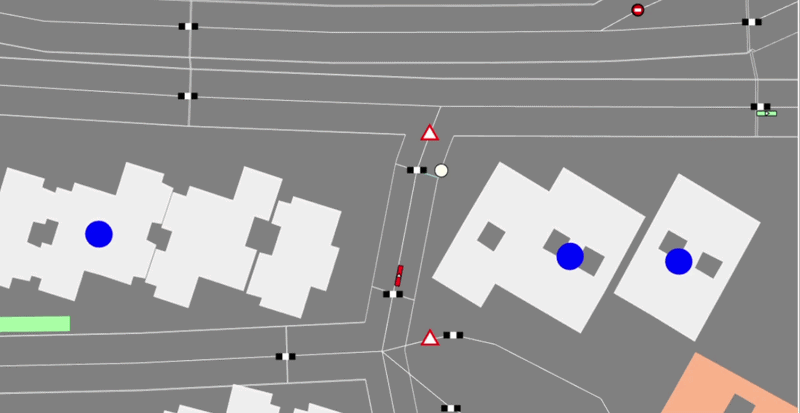
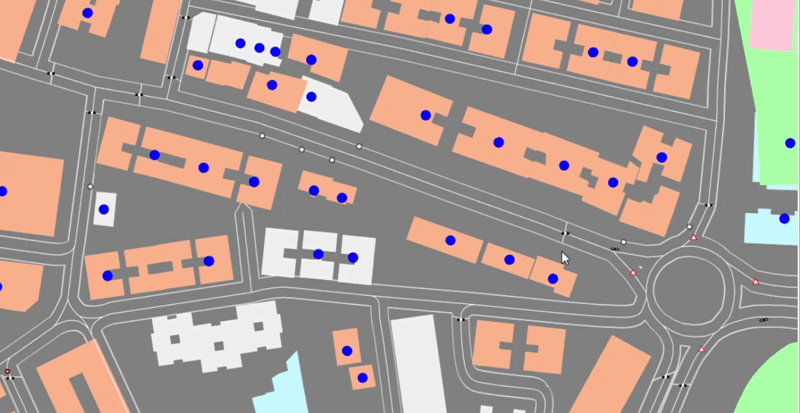
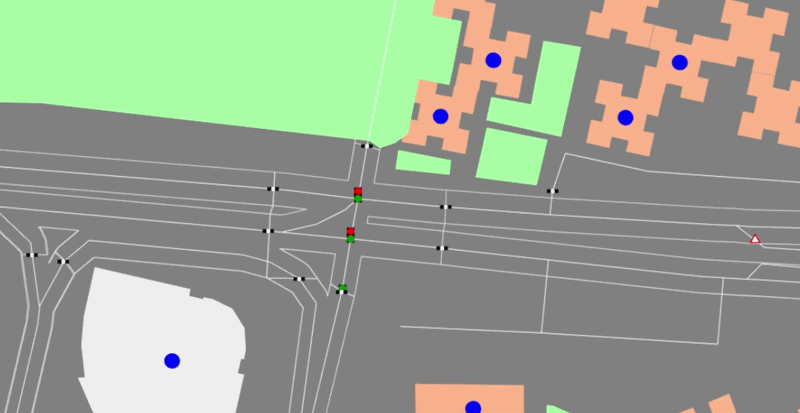
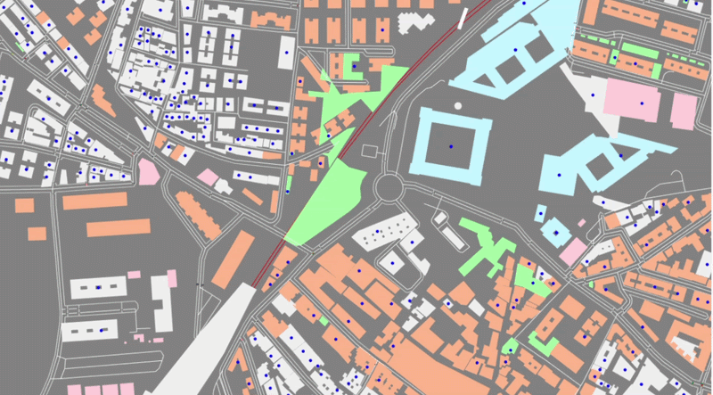

# Movimiento de las personas

Cuando una persona está en reposo dentro de la simulación, se representa como
un punto azul. En este estado no realiza ningún desplazamiento, sino que
permanece en su vivienda o en su lugar de trabajo, desarrollando una actividad
acorde a su perfil, como descansar o trabajar.

En determinados momentos, por ejemplo al comenzar o terminar la jornada
laboral, o al surgir una actividad, aparece una necesidad de desplazamiento. La
persona pasa entonces a tener un objetivo concreto, lo que activa el proceso de
planificación del viaje, aunque todavía no implica movimiento.

## Viajes por la mañana

Por la mañana, las personas realizan principalmente desplazamientos asociados a
sus obligaciones cotidianas. En función de la edad, estos viajes se orientan
hacia centros educativos, lugares de trabajo o equipamientos equivalentes,
constituyendo el bloque principal de movilidad estructurada del inicio de la
jornada.

<table class="trip-purpose-table">
  <thead>
    <tr>
      <th style="text-align: center;">Infante (0-5)</th>
      <th style="text-align: center;">Niño (6-12)</th>
      <th style="text-align: center;">Adolescente (13-17)</th>
      <th style="text-align: center;">Joven (18-30)</th>
      <th style="text-align: center;">Adulto (31-64)</th>
      <th style="text-align: center;">Mayor (65+)</th>
    </tr>
  </thead>
  <tbody>
    <tr>
      <td style="text-align: justify; vertical-align: top;">Guardería</td>
      <td style="text-align: justify; vertical-align: top;">Escuela primaria</td>
      <td style="text-align: justify; vertical-align: top;">Educación secundaria / instituto</td>
      <td style="text-align: justify; vertical-align: top;">Universidad o trabajo</td>
      <td style="text-align: justify; vertical-align: top;">Trabajo (oficinas, comercios, hospitales, etc.)</td>
      <td style="text-align: justify; vertical-align: top;">No asignado (generalmente jubilado)</td>
    </tr>
  </tbody>
</table>

## Viajes por la tarde

Por la tarde, la movilidad deja de estar centrada en la jornada laboral o
educativa y pasa a depender de actividades complementarias, como ocio, compras,
deporte, acompañamiento o gestiones cotidianas. Estas decisiones se modelan
mediante distribuciones probabilísticas distintas para cada grupo de edad. Por
el momento, estos porcentajes responden a una parametrización de trabajo y no
están respaldados directamente por estadísticas específicas ni por estudios
empíricos detallados, aunque constituyen una base razonable para la simulación
actual y podrían calibrarse en el futuro a partir de datos observados.

| Actividad | Infante | Niño | Adolescente | Joven | Adulto | Mayor |
| --- | ---: | ---: | ---: | ---: | ---: | ---: |
| Descanso | 40% | 50% | 20% | 20% | 40% | 50% |
| Paseo | 20% | - | - | 20% | 15% | 15% |
| Visita al parque | 20% | - | - | - | - | - |
| Visita a amigos | - | 25% | - | - | - | - |
| Actividad deportiva | - | 25% | 20% | 5% | 20% | - |
| Compras | - | - | 20% | 20% | 10% | 10% |
| Cafeterías | - | - | 20% | 20% | 10% | 10% |
| Bares | - | - | 20% | 20% | 10% | - |
| Supermercado | - | - | - | - | 10% | - |
| Iglesia | - | - | - | - | - | 10% |
| Visita al médico | 20% | - | - | - | - | 15% |

A partir de ese objetivo, el modelo decide cómo se realizará el
desplazamiento. Un aspecto clave en esta decisión es la distinción entre
trayectos cortos y largos. En esta versión, no se mide la distancia real, sino
que se utiliza una heurística estructural: se considera larga distancia cuando
el origen o el destino están asociados a otra ciudad.

Una vez elegido el modo de transporte, el viaje comienza. Si se trata de un
desplazamiento a pie, la propia persona ejecuta el movimiento. En cambio, si se
utiliza coche, taxi o tren, el control del trayecto se delega en esos agentes,
pasando la persona a formar parte de su dinámica de movimiento.

## Flujo del desplazamiento peatonal

Cuando el desplazamiento se realiza caminando, el sistema inicia una fase de
preparación en la que busca puntos accesibles de la red peatonal cercanos al
origen y al destino. A partir de ellos intenta construir una ruta, aunque no
es necesario que esta exista correctamente desde el primer momento. El modelo
permite comenzar el movimiento y resolver posibles fallos posteriormente
mediante la exploración de alternativas cercanas.

Una vez en marcha, la persona avanza de forma continua por la red, con
capacidad de reajustar su trayectoria si es necesario. Durante este proceso, se
tienen en cuenta elementos como los pasos de cebra, donde se activa una lógica
específica que regula la interacción con el tráfico y evita conflictos con los
vehículos.

*Vehículo detenido ante un paso de cebra para permitir el cruce peatonal.*

*Desplazamiento peatonal en ambos sentidos dentro de la red de movimiento.*

El desplazamiento finaliza cuando la persona alcanza el punto asociado a su
destino y es recolocada en el edificio correspondiente. En ese momento se
limpia el estado del viaje y se da por completado, salvo en casos como el
tren, donde la llegada a una estación puede ser solo una etapa intermedia
dentro de un trayecto más complejo.

## Flujo del desplazamiento en coche

El coche se inicializa en un punto de la red cercano a la posición de la
persona y recibe como destino otro punto próximo al edificio objetivo. Además,
puede transportar no solo a la persona principal, sino también a acompañantes
asociados a la misma actividad, de modo que un único vehículo puede encapsular
varios desplazamientos simultáneos.

Una vez creado, el coche entra en una fase de planificación en la que intenta
construir una ruta válida sobre la red de carreteras. El primer intento se
realiza directamente entre el origen y el destino previstos. Si este cálculo
tiene éxito, el vehículo queda listo para circular. Sin embargo, si la ruta no
puede establecerse, el modelo no aborta inmediatamente el viaje, sino que
activa un mecanismo de recuperación que busca alternativas cercanas. En lugar
de insistir sobre el mismo trayecto, el sistema prueba nuevos puntos de origen
y destino dentro de un entorno próximo, aumentando así la probabilidad de
encontrar una solución viable.

Cuando el coche dispone de una ruta válida, comienza la conducción propiamente
dicha.

Durante este proceso, el vehículo no avanza de forma aislada, sino que adapta
continuamente su comportamiento al entorno. Antes de cada movimiento, analiza
la intersección a la que se aproxima y decide si debe detenerse o ceder el paso
en función de la situación. Este control incluye la gestión de prioridades,
señales de stop y pasos de cebra, donde el coche puede verse obligado a
detenerse temporalmente hasta que se cumplan las condiciones de seguridad
necesarias.

*****VIDEO GIF DE UN COCHE EN CEDA
*****VIDEO GIF DE UN COCHE EN STOP

*Vehículo detenido y regulado por un semáforo dentro de la red viaria.*

*****VIDEO GIF DE UN COCHE EN ROTONDA

Además de respetar estas reglas, el modelo supervisa si el coche progresa
adecuadamente.

El viaje finaliza cuando el coche alcanza su destino operativo dentro de la
red. En ese momento, los pasajeros son trasladados al edificio real asociado a
su objetivo, se cierra el registro del trayecto y el vehículo desaparece del
sistema.

## Pedir un taxi

Cuando una persona selecciona el taxi como modo de transporte, no inicia el
movimiento por sí misma. En su lugar, lanza una petición a un sistema
centralizado que gestiona la flota.

La petición se transforma en un viaje dentro del sistema, lo que permite
gestionar colas, tiempos de espera y asignaciones de forma desacoplada. La
centralita evalúa que taxis están realmente disponibles, es decir, no solo sin
pasajero, sino también operativos y sin restricciones como batería baja, y
asigna el más adecuado en función de criterios de proximidad y espera
acumulada.

Una vez asignado, el taxi adopta la solicitud y comienza a dirigirse hacia el
pasajero. En esta fase, el vehículo abandona cualquier comportamiento previo de
deambulación y pasa a ejecutar una misión concreta. El destino del taxi deja de
ser abstracto y se ajusta dinámicamente según la fase del servicio: primero el
punto de recogida y, tras incorporar al pasajero, el destino final del viaje.

El desplazamiento del taxi sigue la misma lógica de conducción que otros
vehículos del modelo. Esto implica que planifica rutas sobre la red viaria,
respeta intersecciones, cede el paso cuando es necesario y puede verse afectado
por situaciones como tráfico o bloqueos. Sin embargo, a diferencia del coche
privado, su comportamiento está condicionado por su estado de servicio, ya que
alterna entre recogida, transporte y disponibilidad.

Cuando el taxi alcanza al pasajero, se produce la recogida y el viaje entra en
su fase principal. El sistema recalcula la ruta hacia el destino final y el
vehículo continúa el trayecto hasta completar la entrega. Al llegar, la persona
es situada directamente en su destino, se cierra el viaje y el taxi vuelve a
estar disponible para nuevas solicitudes.

Además, el modelo introduce una capa adicional de realismo mediante la gestión
de la batería. Si el nivel de carga desciende por debajo de un umbral, el taxi
deja de aceptar nuevas solicitudes y se desvía hacia un punto de recarga. Solo
cuando finaliza este proceso vuelve a incorporarse al sistema como vehículo
disponible.

En situaciones en las que el taxi no puede completar su misión, por ejemplo si
no logra encontrar una ruta válida o queda bloqueado durante demasiado tiempo,
el sistema activa mecanismos de aborto que garantizan la consistencia del
modelo. En estos casos, los pasajeros son recolocados en una ubicación
coherente y el vehículo vuelve a un estado estable, evitando que queden
trayectos abiertos o estados inconsistentes.

## Trayecto en tren

El tren introduce un tipo de desplazamiento diferente al resto, ya que no se
resuelve en un único trayecto continuo, sino en varias etapas encadenadas.
Cuando una persona selecciona este modo de transporte, el modelo transforma el
viaje en una secuencia que combina desplazamientos locales con transporte
ferroviario.

El primer paso consiste en adaptar el destino real a un objetivo operativo. Si
la persona se encuentra dentro del área simulada, el sistema establece como
objetivo inicial una estación cercana, lo que implica que el viaje comienza
normalmente a pie. En cambio, si la persona ya está asociada a una ciudad
externa, se incorpora directamente al sistema ferroviario como pasajera en
espera.

Una vez que la persona alcanza la estación, deja de moverse activamente y pasa
a formar parte de una cola de espera. En este punto, el control del
desplazamiento se transfiere completamente al sistema de trenes. La persona ya
no decide su movimiento, sino que espera a ser recogida por un tren que siga la
ruta adecuada.

El tren recorre la red ferroviaria realizando paradas en distintas estaciones.
Durante estas paradas, gestiona la subida y bajada de pasajeros en función de
su destino. Si una persona alcanza una estación intermedia, el modelo la extrae
del tren y reactiva su proceso de movilidad, asignándole como nuevo objetivo su
destino final real. Esto permite completar el viaje mediante una última etapa,
normalmente caminando.

Cuando el tren llega a la estación final asociada al destino del pasajero, el
viaje se completa directamente. La persona es colocada en su destino final y se
cierra el trayecto sin necesidad de pasos adicionales.

A diferencia del desplazamiento en coche o taxi, el modelo no enfatiza la
posición continua de la persona durante el trayecto en tren. En su lugar, se
centra en los momentos clave del flujo: entrada en el sistema, espera,
transporte y salida.

*Vídeo del tren entrando en la estación.*
