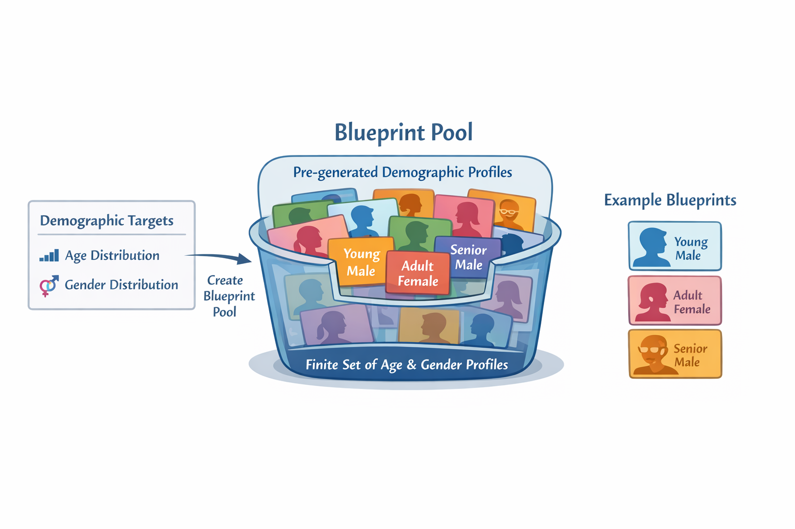
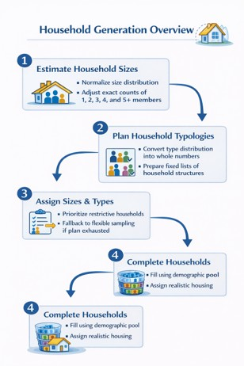
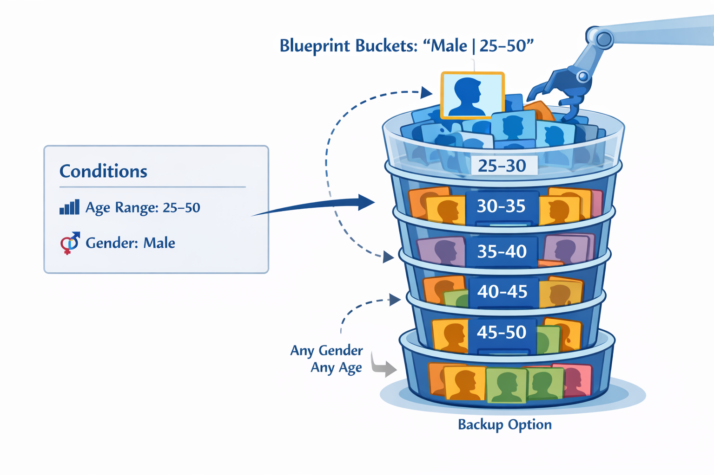
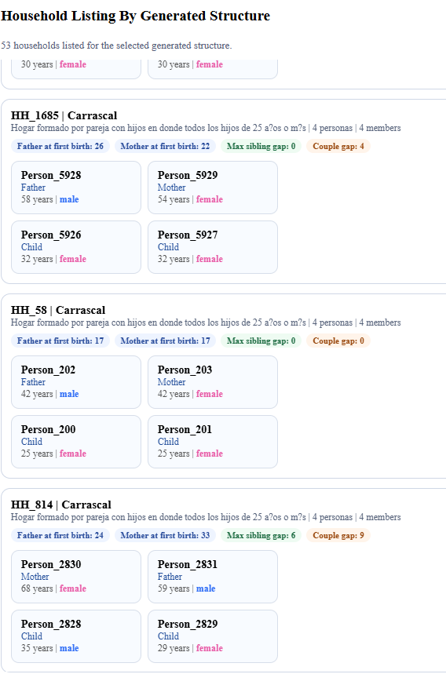

# Generación de población sintética y creación de hogares

El proceso de generación de la población se organiza en dos etapas principales. En la primera se define la estructura demográfica agregada que se desea obtener, es decir, cuántas personas debe haber en cada rango de edad y en cada categoría de sexo. En la segunda, esa estructura se materializa mediante la creación de individuos concretos dentro de hogares y la asignación de relaciones entre ellos.

Esta separación es importante porque, si cada persona se generara de forma completamente independiente —por ejemplo, sorteando de forma ponderada en cada caso su edad, su sexo y su tipo de hogar—, se ha observado que el resultado final se aleja de las distribuciones objetivo. Este efecto se acentúa al introducir reglas de formación de hogares, como parejas, hijos o familias monoparentales, ya que dichas reglas imponen restricciones sobre qué combinaciones de personas son posibles dentro de un mismo hogar.

Para evitar este problema, el modelo no genera directamente a los individuos mediante sorteos independientes, sino que primero construye una reserva finita de perfiles demográficos, denominada *blueprint pool*. Para ello, las probabilidades de edad y sexo se normalizan, se corrigen posibles etiquetas inválidas y se transforman en conteos enteros que suman exactamente los N habitantes deseados mediante el método del mayor resto aplicado en cada grupo.

A partir de esos conteos se construyen dos listas, *age_plan* y *gender_plan*, en las que cada categoría aparece tantas veces como individuos le corresponden; por ejemplo, si al grupo de edad 25–29 le corresponden 8 personas, dicha etiqueta se inserta 8 veces en *age_plan*.

Los *blueprints* se obtienen emparejando por índice ambas listas, de modo que cada uno representa un perfil básico asociado a un sexo y a un rango de edad. Sin embargo, como este procedimiento parte de dos planes independientes —uno para edad y otro para sexo—, por lo que garantiza las distribuciones marginales de ambas variables, pero no necesariamente su distribución conjunta edad × sexo, la cual no se tiene en cuenta en esta generación.

Una vez construido el *blueprint pool*, el modelo genera los hogares y las personas consumiendo progresivamente esos perfiles. De este modo, la población final no depende únicamente del azar local, sino que tiende a ajustarse a las proporciones demográficas previstas desde el inicio. No obstante, este ajuste se mantiene sobre todo a nivel agregado, ya que durante el consumo de *blueprints* se introducen ciertas relajaciones para poder completar hogares compatibles.

La utilización de rangos de edad en lugar de edades exactas responde a que las fuentes empleadas —como censos o datos del INE— están disponibles en estas categorías discretas.

*Esquema conceptual del proceso de construcción y organización del* blueprint pool, *donde se representan los perfiles demográficos generados y su posterior estructuración para su uso en la creación de individuos.*

Una vez creado el conjunto de *blueprints*, estos perfiles se agrupan en una estructura de acceso rápido según la combinación de sexo y tramo de edad, denominada *bucket*. Así, cada grupo reúne perfiles homogéneos, como por ejemplo mujeres de 25 a 29 años o varones de 30 a 34. Esta organización permite localizar con rapidez los perfiles compatibles con las restricciones demográficas que impone cada nueva persona a generar.

Cuando el sistema necesita crear un individuo, normalmente no trabaja con una edad exacta, sino con condiciones más amplias, como pertenecer a un determinado intervalo de edad o ajustarse a un cierto tipo de rol dentro del hogar. En esos casos, el modelo identifica qué tramos de edad son compatibles con la restricción solicitada y reúne todos los *buckets* candidatos asociados. Por ejemplo, si se necesita una mujer adulta de entre 25 y 59 años, se consideran todos los perfiles femeninos cuyos tramos de edad queden comprendidos dentro de ese intervalo.

A partir de ese conjunto de candidatos, el sistema seleccionará un perfil disponible en base a las necesidades de creación y lo asignará a la nueva persona, como se detallará más adelante. Gracias a este mecanismo, la generación no se realiza mediante sorteos completamente libres, sino sobre una reserva previamente construida de perfiles demográficos compatibles.

En términos conceptuales, esta reserva funciona como un conjunto finito de “tickets demográficos” que se consumen sin reemplazo, lo que ayuda a que la población final tienda a respetar los conteos objetivo y no dependa únicamente de las fluctuaciones aleatorias acumuladas.

## Creación de hogares

En paralelo a la preparación demográfica, el modelo planifica la estructura de hogares que alojará a la población generada. Para ello, parte de la distribución de tamaños de hogar, la normaliza y calcula el tamaño medio esperado, lo que permite estimar cuántos hogares serán necesarios para alojar al total de personas.

A partir de esa estimación, las probabilidades asociadas a cada tamaño se transforman en conteos enteros de hogares mediante el método del mayor resto. Como este primer ajuste puede no producir exactamente el número total de personas deseado, el plan se corrige posteriormente: si faltan personas, se añaden hogares adicionales; si sobran, se eliminan o reducen hogares de mayor tamaño hasta equilibrar el total. De este modo se obtiene una planificación agregada del número de hogares de 1, 2, 3, 4 y 5 o más miembros.

Además del tamaño, cada hogar debe responder a una determinada estructura familiar, como pareja sin hijos, pareja con hijos, hogar monoparental u otras configuraciones. Para cada tamaño existe una distribución específica de estas tipologías, y el modelo convierte también esas probabilidades en conteos enteros.

Así, en lugar de decidir el tipo de cada hogar de manera completamente aleatoria en el momento de crearlo, el sistema prepara de antemano una reserva de estructuras por tamaño y las utiliza progresivamente. Esto permite mantener proporciones más estables y realistas en la composición global de los hogares.

Durante la generación, a cada hogar se le asigna primero un tamaño y después una tipología compatible con ese tamaño, siguiendo la planificación previamente construida. Si en algún caso esta planificación no puede aplicarse —por agotamiento o por inconsistencias acumuladas—, el sistema recurre a una selección puntual como mecanismo de respaldo.

En conjunto, esta estrategia permite controlar a nivel agregado tanto el tamaño como la estructura de los hogares, reduciendo desviaciones debidas al azar.

La construcción de los hogares no se realiza en un orden completamente indiferente. El modelo prioriza primero las configuraciones más restrictivas, como los hogares con hijos; después las menos condicionadas, como las parejas sin hijos; y finalmente las categorías residuales. Dentro de cada bloque se introduce aleatoriedad, pero esta prioridad ayuda a resolver antes los casos con mayores restricciones de edad, parentesco y composición.

La creación efectiva de cada hogar incluye también una asignación espacial. En primer lugar, se selecciona un ámbito territorial de residencia a partir de una distribución predefinida de distritos. Posteriormente, el hogar se vincula a una vivienda concreta, elegida preferentemente a partir de una organización previa de edificios residenciales por zona, lo que evita búsquedas repetidas y mejora la consistencia espacial.

Además, el modelo contempla una pequeña proporción de hogares que se ubican fuera del área principal de estudio, asociándolos a puntos de entrada externos que representan, los municipios colindantes. Aunque esta parte no interviene en la composición demográfica del hogar, sí fija el lugar de residencia común que compartirán todos sus miembros.

{ .center }

*Esquema conceptual del proceso de planificación y generación de hogares, en el que se representan la asignación de tamaños, tipologías y su posterior materialización en la población.*

## Generación de miembros de hogar

Una vez que el modelo ya sabe cuántas personas viven en un hogar, qué tipo de hogar es y en qué vivienda reside, el siguiente paso consiste en crear a las personas que lo componen. Para ello, el sistema utiliza una función que puede entenderse como un generador de individuos. Su tarea no es crear personas al azar, sino construirlas respetando restricciones demográficas como la edad, el sexo y la relación con el resto de miembros del hogar.

La generación de los miembros depende de la estructura familiar previamente asignada. En función de dicha estructura, el modelo sigue secuencias distintas para garantizar una composición coherente. Por ejemplo, en los hogares con hijos se generan primero los hijos y después los adultos; en los hogares monoparentales se crea al progenitor en relación con los hijos ya definidos; y en las parejas sin hijos se genera primero a un adulto y, a continuación, a su pareja.

De este modo, la creación de personas no se resuelve como una sucesión de sorteos independientes, sino como un proceso condicionado por el papel que cada individuo desempeña dentro del hogar.

Cuando el modelo necesita crear una persona, establece primero un conjunto de restricciones mínimas, normalmente un intervalo de edad y, en algunos casos, también un sexo concreto. A partir de esas condiciones, busca un perfil demográfico compatible dentro de la reserva de perfiles disponibles.

Para agilizar esta búsqueda, los perfiles se encuentran organizados en *buckets*, tal y como se describió anteriormente. Por ejemplo, si el sistema necesita generar un varón adulto, consulta directamente los grupos correspondientes a varones en los tramos de edad admisibles.

De esta forma, el sistema no recorre todo el conjunto de perfiles, sino que accede directamente a los *buckets* válidos. El tamaño de estos grupos es proporcional a la probabilidad que representa cada categoría, lo que permite que la selección respete, en la medida de lo posible, la estructura estadística prevista.

En caso de que no existan *blueprints* compatibles disponibles, el modelo genera una persona que cumpla las restricciones requeridas, actuando este mecanismo como una solución de respaldo.

*Esquema conceptual de la organización de perfiles demográficos en buckets según combinaciones de sexo y tramo de edad, lo que permite un acceso eficiente a perfiles compatibles durante la generación de individuos.*

La extracción de perfiles sigue una estrategia de relajación escalonada: se intenta primero una coincidencia exacta y, en caso de no ser posible, se recurre progresivamente a combinaciones más amplias según la disponibilidad, manteniendo el control estadístico sin bloquear la generación.

La creación de una pareja sigue además reglas específicas. Cuando debe generarse la pareja de una persona ya existente, el modelo no la asigna de forma arbitraria. En primer lugar, determina la orientación de la unión a partir de las proporciones estadísticas disponibles y, con ello, infiere el sexo esperado de la pareja.

A continuación, la edad tampoco se elige libremente, sino de forma condicionada por la edad del primer miembro de la pareja. Para ello, el modelo selecciona primero un intervalo de diferencia de edad a partir de una distribución global y, a partir de esa restricción, identifica los tramos de edad compatibles para la segunda persona. Entre estas opciones, la selección final se realiza de acuerdo con las probabilidades asociadas a la edad del cónyuge.

Además, cuando la persona ya generada tiene hijos, el modelo introduce una nueva restricción basada en la relación entre la edad del primer hijo y la distribución de edades a la maternidad. Esta comprobación se combina con una condición adicional de plausibilidad parental, evitando asignar parejas cuya edad resulte incoherente con la edad de los hijos presentes en el hogar.

En conjunto, esta etapa traduce una estructura de hogar abstracta en una configuración concreta de personas relacionadas entre sí mediante referencias. De este modo, el hogar resultante no responde únicamente a distribuciones demográficas agregadas, sino también a reglas internas de compatibilidad que refuerzan su coherencia y plausibilidad en términos de edad, sexo y parentesco.
## Monitorización

Con el fin de validar la población sintética generada y analizar su comportamiento, el modelo incorpora un sistema de monitorización basado en ficheros de salida producidos desde GAMA. En particular, durante la ejecución se generan registros como `households.csv`, `household_members.csv`, `trips.csv` y `events.csv`, que posteriormente son utilizados por herramientas externas de análisis.

`dashboard_households.py` está orientado a la inspección detallada de los hogares generados. A partir de los registros de hogares y de sus miembros, permite filtrar por distrito o zona, por tamaño y por tipo de familia u hogar generado, así como centrarse en aquellos casos que presentan discrepancias. Además de mostrar resúmenes agregados, el panel permite consultar hogares concretos con sus miembros listados, incluyendo edades y relaciones familiares, lo que facilita revisar manualmente la coherencia interna de cada unidad doméstica.

*Panel de inspección de hogares, utilizado para filtrar la población sintética y revisar el detalle de cada hogar junto con sus miembros.*

Por su parte, `dashboard_monitor.py` se centra en la monitorización global de la simulación. Gracias a los logs generados en GAMA, este panel puede visualizar indicadores sobre viajes, modos de transporte, planificación de rutas, incidencias registradas durante la ejecución y comparación entre resultados simulados y distribuciones objetivo. De este modo, no solo permite observar la evolución general del modelo, sino también detectar fallos, trayectorias problemáticas o desviaciones respecto al comportamiento esperado.
