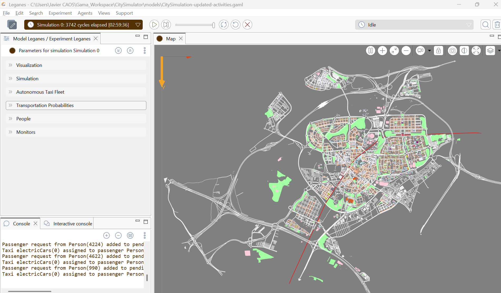
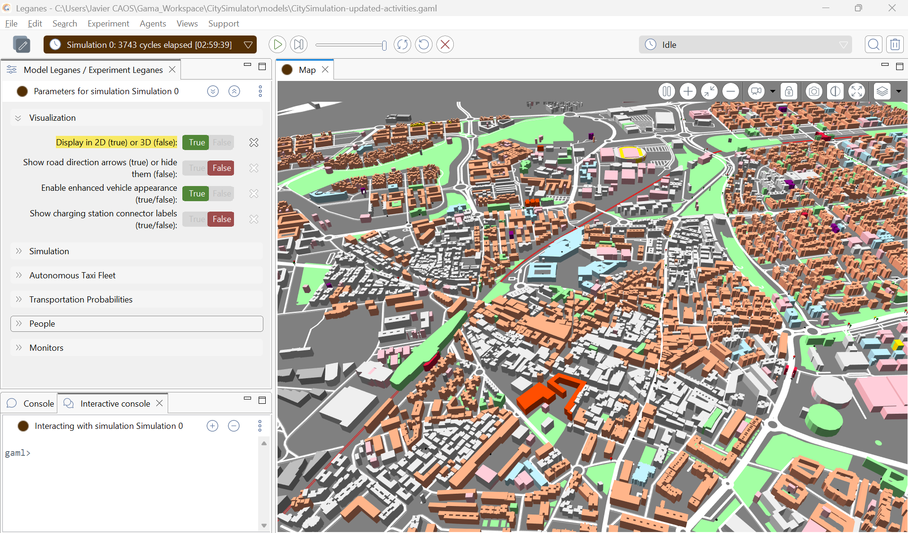

# Control de la interfaz y monitorizacion

En esta seccion se presenta el cuadro de mando del simulador, asi como las
principales opciones de control disponibles durante la ejecucion.

*Vista del cuadro de mando del modelo, donde se pueden ajustar parametros y
monitorizar la simulacion en tiempo real.*

El sistema permite modificar distintos parametros del modelo de forma
interactiva, facilitando la exploracion de escenarios y el analisis de su
impacto sobre la dinamica del trafico y la movilidad.

Uno de estos parametros permite visualizar el modelo en tres dimensiones.

*Vista del cuadro de mando del modelo desplegado en tres dimensiones.*

## Generacion de logs

Durante la ejecucion, el modelo genera registros que recogen informacion
detallada sobre el comportamiento de los agentes.

Estos logs permiten analizar aspectos como:

- Origen y destino de los desplazamientos
- Trayectorias seguidas por los agentes
- Eleccion de modos de transporte
- Tiempos de viaje

Esta informacion resulta clave para la validacion del modelo y el analisis
posterior de los resultados.

## Dashboard de analisis

Ademas, se ha desarrollado un dashboard en Python para la visualizacion y el
analisis de los datos generados por la simulacion.

Este entorno permite:

- Analizar los flujos de movilidad
- Ver la composicion de hogares
- Visualizar metricas agregadas
- Comparar distintos escenarios de simulacion
- Explorar el comportamiento de los agentes de forma interactiva
