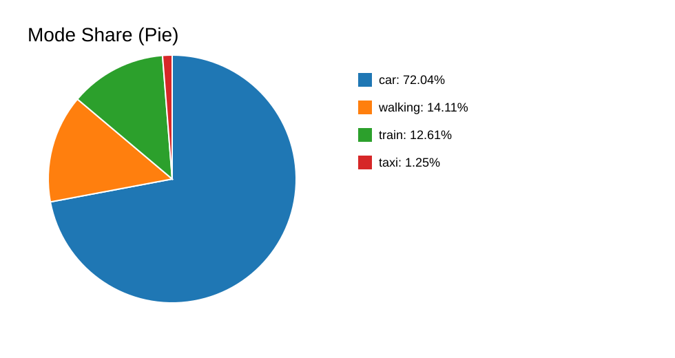
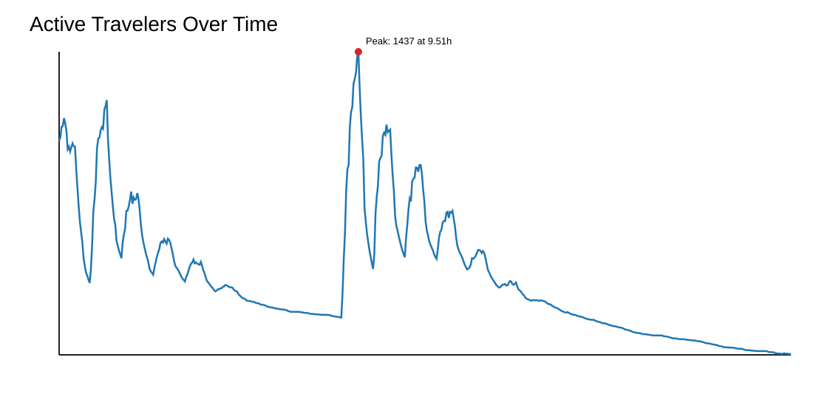

# Simulation Analysis Report

## Mode Shares
- **car**: 72.04%
- **walking**: 14.11%
- **train**: 12.61%
- **taxi**: 1.25%

### Expected vs Observed by Mode
- **car**: observed=72.04%, expected(mixed)=67.81%, delta=4.23 pp
- **taxi**: observed=1.25%, expected(mixed)=2.83%, delta=-1.58 pp
- **train**: observed=12.61%, expected(mixed)=16.59%, delta=-3.98 pp
- **walking**: observed=14.11%, expected(mixed)=12.77%, delta=1.34 pp

## Travel Demand Over Time
- **Peak travelers in transit**: 1437 at 9.51h
- **Average travelers in transit**: 365.43
- **P95 travelers in transit**: 1025.25
- **Peak/Mean ratio**: 3.93
- **Hours above P90 demand**: 2.37

## Trip Consistency
- **Total trips**: 16304
- **Closure rate**: 100.00%
- **Non-positive durations**: 336

## Worker Return Consistency
- **Workers with outbound trips**: 7336
- **Workers with resting return**: 4371
- **Return rate (resting)**: 59.58%

## Schedule Trigger Flow
- **Work departures (events)**: 7674
- **Home returns (events)**: 7337
- **Home return / work departure ratio**: 95.61%
- **Gap (work - home)**: 337

## Assigned Work Schedule (Population)
- **Unique start hours**: 7
- **Unique end hours**: 7

## Train Consistency
- **Train trips**: 2056
- **Train zero-duration trips**: 74
- **Persons with both train+walking trips**: 0
- **Train queue entries**: 1136
- **Train alight+continue events**: 2
- **Alight-after-queue ratio**: 0.18%

## Trip Event Lifecycle
- **Trip start events**: 18765
- **Trip end events**: 16304
- **Event closure rate**: 86.89%
- **Unclosed trip ids**: 2461
- **Orphan end trip ids**: 0

## Real vs Simulated Comparison
- **household_size**: MAE=0.0001, RMSE=0.0001, JS=0.0000
- **gender**: MAE=0.0043, RMSE=0.0043, JS=0.0000
- **age_range**: MAE=0.0103, RMSE=0.0128, JS=0.0141
- **district**: MAE=0.0060, RMSE=0.0072, JS=0.0003
- **work_start_hour**: MAE=0.0037, RMSE=0.0054, JS=0.0002
- **transport_vs_short_target**: MAE=0.1375, RMSE=0.1641, JS=0.0821
- **transport_vs_long_target**: MAE=0.0705, RMSE=0.0919, JS=0.0602
