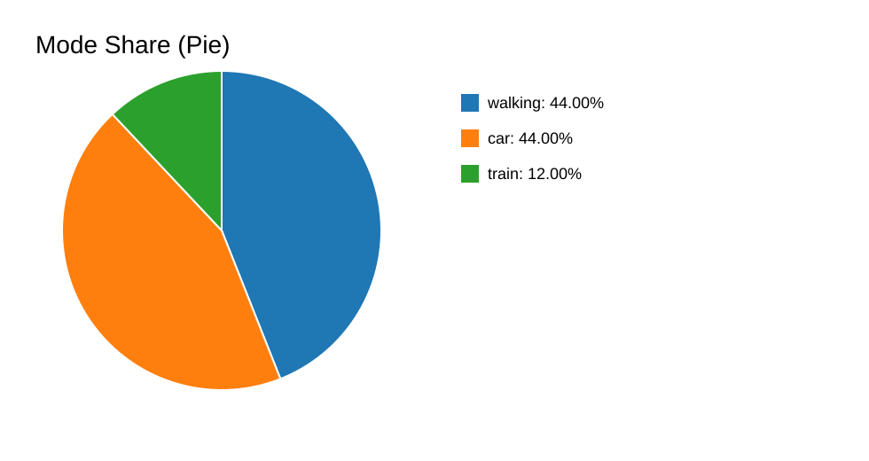
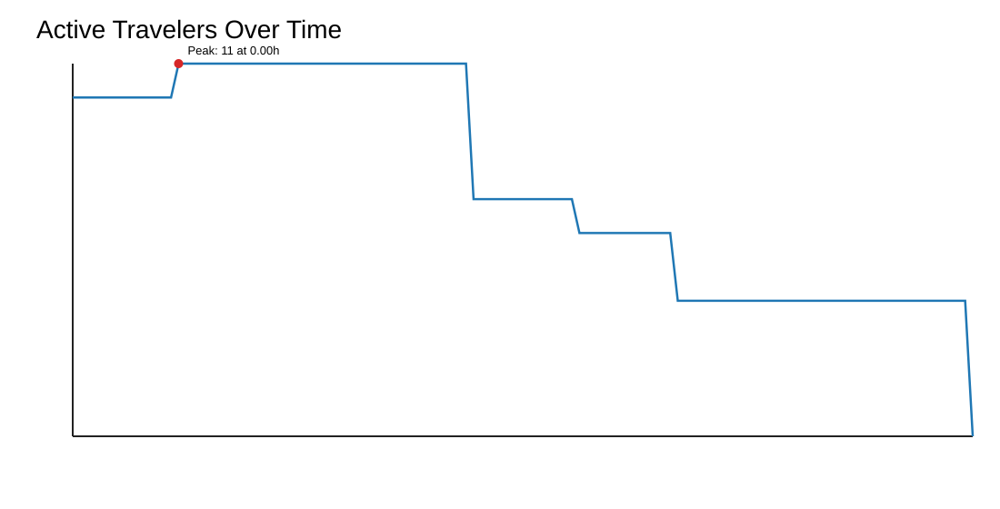

# Simulation Analysis Report

## Mode Shares
- **walking**: 44.00%
- **car**: 44.00%
- **train**: 12.00%

### Expected vs Observed by Mode
- **car**: observed=44.00%, expected(mixed)=67.35%, delta=-23.35 pp
- **taxi**: observed=0.00%, expected(mixed)=2.81%, delta=-2.81 pp
- **train**: observed=12.00%, expected(mixed)=15.88%, delta=-3.88 pp
- **walking**: observed=44.00%, expected(mixed)=13.96%, delta=30.04 pp

## Travel Demand Over Time
- **Peak travelers in transit**: 11 at 0.00h
- **Average travelers in transit**: 7.51
- **P95 travelers in transit**: 11.00
- **Peak/Mean ratio**: 1.47
- **Hours above P90 demand**: 0.00

## Trip Consistency
- **Total trips**: 25
- **Closure rate**: 100.00%
- **Non-positive durations**: 14

## Worker Return Consistency
- **Workers with outbound trips**: 25
- **Workers with resting return**: 0
- **Return rate (resting)**: 0.00%

## Schedule Trigger Flow
- **Work departures (events)**: 1189
- **Home returns (events)**: 0
- **Home return / work departure ratio**: 0.00%
- **Gap (work - home)**: 1189

## Assigned Work Schedule (Population)
- **Unique start hours**: 7
- **Unique end hours**: 8

## Train Consistency
- **Train trips**: 3
- **Train zero-duration trips**: 3
- **Persons with both train+walking trips**: 0
- **Train queue entries**: 81
- **Train alight+continue events**: 0
- **Alight-after-queue ratio**: 0.00%

## Trip Event Lifecycle
- **Trip start events**: 1189
- **Trip end events**: 25
- **Event closure rate**: 2.10%
- **Unclosed trip ids**: 1164
- **Orphan end trip ids**: 0

## Real vs Simulated Comparison
- **household_size**: MAE=0.0001, RMSE=0.0001, JS=0.0000
- **gender**: MAE=0.0061, RMSE=0.0061, JS=0.0000
- **age_range**: MAE=0.0085, RMSE=0.0107, JS=0.0093
- **district**: MAE=0.0079, RMSE=0.0090, JS=0.0005
- **work_start_hour**: MAE=0.0036, RMSE=0.0042, JS=0.0001
- **transport_vs_short_target**: MAE=0.0776, RMSE=0.0915, JS=0.0545
- **transport_vs_long_target**: MAE=0.2200, RMSE=0.2702, JS=0.1914
